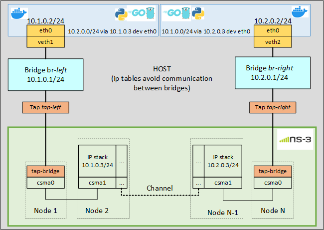

# Docker communication over ns-3

This is a simple setup to allow communication between docker containers through _ns-3_ simulator as channel. The network setup is shown in the figure below.



## Dependencies

It has been tested in _Ubuntu 20.04.3 LTS (focal)_. It has the following dependencies:

- _python3_, _pip3_, _brctl_, _tunctl_, _ip_ (should be there, just in case)

```
apt install python3
apt install python3-pip
apt install bridge-utils
apt install uml-utilities
apt install iproute2
```

- [Docker engine](https://docs.docker.com/engine/install/ubuntu/)
- [Docker compose](https://docs.docker.com/compose/install/)
- [ns-3](https://www.nsnam.org/wiki/Installation#Ubuntu.2FDebian.2FMint)

## Project Structure

- _Dockerfile_: edit it to use different images. So fat the containers are based on _alpine:latest_ and coy the current directory in the Docker _home_. The current images include:

  - _go1.17.7_

  - _python3_ and _pip3_

  - _iperf3_

- _docker_compose.yml_: generate the Docker networks and instantiate the containers. On boot, the routing table of the containers are modified using the script _AdaptRouteTable.py_. Containers keep running doing nothing so we can pass them commands.

- _BuildUp.py_: this is an automatization to setup the whole network, including _ns3_. At the end it stop all the elements and tears down the network. You will want to customize the following parameters:

  - Set the information under **[NS3 INFO]** according to your setup (path of _ns3_ and scenario name). A simple scenario is include in folder _ns3_scenarios_, it has been tested for _ns3.35_.

  - Set the information under **[PROGRAMS]** to run your experiments. So far it runs the programs in the folder _programs_ that just ping between both containers

## Usage

To run network the the _BuildUp.py_ file:

```shell
python3 BuildUp.py
```

# Contact

Luis Diez; [email](mailto:ldiez@tlmat.unican.es). [University of Cantabria](https://web.unican.es/), [Communications Engineering Department](https://www.tlmat.unican.es/).
